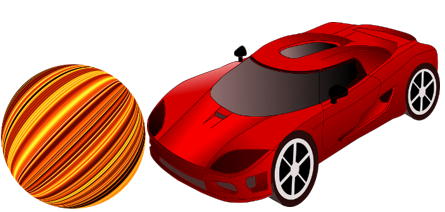

# Bumper Ball! 

Virtual reality meets the real world &mdash; and there are cars and a ball!

- [Meet Bumper Ball](#meet-bumper-ball)
- [Playing the Game](#playing-the-game)
- [Setup and Installation](#setup-and-installation)

## Meet Bumper Ball

Bumper Ball is a game that introduces a new way of integrating the digital and physical worlds.
A virtual soccer field, ball, and other objects, are projected as an image onto a real-world game board.
You use remote-control activated toy cars to move the virtual ball around the board and score goals.
The game distinguishes between the cars, identifies their movement, direction, and velocity, and reacts accordingly, in real time.

### Who Should Play Bumper Ball?

Bumper Ball is for everyone!

- [x] Enjoy some wholesome fun with the entire family
- [x] Save money on a babysitter while you get things done
- [x] Alleviate stress and bond with colleagues at the office
- [x] Play drunken Bumper Ball with legal-age friends (just don't drink and drive!)

### Playing the Game

Use your car to score goals by advancing the virtual game ball into your opponent's goal, and block your opponent from scoring goals.
On the way, avoid the obstacles that appear on the board, and collect gifts that provide you with advantages over your opponent.
The winner is the player who scores the most goals within the allocated time.

## Setup and Installation

### Components

Bumper Ball includes the following components:

- The Bumper Ball software binary (**"Bumper Ball"**) &mdash; for example, **BumperBall.exe** for Windows.

- A digital USB camera (**"the camera"**).

- A USB cable.

- Two cardboard cut-outs (**"the game board"**).

- Two remote-control (RC) cars (**"the cars"**).

### Installation

1.  Install Bumper Ball on your computer: simply double-click the software binary and follow the instructions.

2.  Lay out the cardboard cutouts (the game board) on a flat surface, such as your living-room floor or carpet.

3.  Fix the camera to an elevated surface and aim it at the board.

4.  Connect the computer to the camera using the USB cable.

___
&copy; 2018 Bumper Boiz, All Rights Reserved
<!--
&nbsp;&nbsp;&nbsp;&nbsp;&nbsp;&nbsp;&nbsp;&nbsp;
<a href="http://iguazio.staging.wpengine.com/bumper-balls/">iguazio.staging.wpengine.com/bumper-balls/</a>
-->

